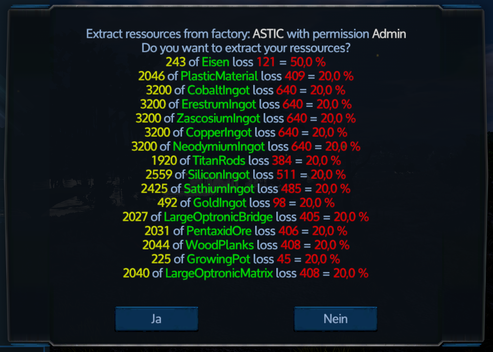

# Empyrion Factory Dealer
## Installation
1. Download der aktuellen ZIP datei von https://github.com/GitHub-TC/EmpyrionFactoryDealer/releases
1. Upload der Datei im EWA (EmpyrionWebAccess) MOD oder händische installation mit dem ModLoader aus https://github.com/GitHub-TC/EmpyrionFactoryDealer

## Wo für ist das?
Ermöglicht zusätzliche Funktine für die Fabrik. Das sofortige Fertigstellen des Blueprints gegen Credits oder die Herausgabe der gespeicherten
Resourcen.

## Kommandos

* \\factory help =&gt; Liste der Kommandos
* \\factory finish =&gt; Die laufende fertigstellung sofort abschließen
* \\factory buyall =&gt; Die in der Fabrik enthaltenen Ressourcen gegen Credits auslösen
* \\factory getall =&gt; Die in der Fabrik enthaltenen Ressourcen mit einer Verlustquote auslösen

## Konfiguration
* LogLevel: Steuerung des Loggings
* ChatCommandPrefix: Zeichenfolge mit dem die Chatkommandos beginnen müssen
* UsePlayerAddItemForTransfer: Ressourcen direkt in das Playerinventar verschieben (Überladung möglich und Stackgröße ignorieren) oder per Austauschmenü (Stackgröße und Überladung berücksichtigen)
* NameIdMappingFile: Für eine Namensauflösung der Ressourcen der Pfad zu der NameIdMapping.json z.B. aus dem EmpyrionScripting
* CostsPerRemainingMinute: Credits pro Minute
* RebuyCostPerUnit: Allgemeine Angabe der Credits pro Ressourceeneinheit
* ExtractionPercentLost: Allgemeine Verlustquote pro Ressourceeneinheit
* Ressources: Liste mit speziellen Werten pro Ressource
  * Item: Spezielle Werte für dieses Item
  * RebuyCostPerUnit: Angabe der Credits für diese Ressourceneinheit
  * ExtractionPercentLost: Angabe der Verlustquote für diese Ressourceneinheit

***

English-Version:

---

# Empyrion Factory Dealer
## Installation
1. Download the current ZIP file from https://github.com/GitHub-TC/EmpyrionFactoryDealer/releases
1. Upload the file in EWA (EmpyrionWebAccess) MOD or manual installation with the ModLoader from https://github.com/GitHub-TC/EmpyrionFactoryDealer

## What is this for?
Allows additional functine for the factory. The immediate completion of the blueprint in exchange for credits or the release of the stored
resources.

## Commands

* \\factory help =&gt; list of commands
* \\factory finish =&gt; Immediately finish the running blueprint
* \\factory buyall =&gt; Buy the resources contained in the factory for credits
* \\factory getall =&gt; Release the resources contained in the factory with a loss rate

## Configuration
* LogLevel: control the logging
* ChatCommandPrefix: string the chat commands must start with
* UsePlayerAddItemForTransfer: Move resources directly into player inventory (overload possible and stacksize exeeded) or via exchange menu (consider stack size and overload).
* NameIdMappingFile: For a name resolution of the resources the path to the NameIdMapping.json e.g. from EmpyrionScripting.
* CostsPerRemainingMinute: Credits per minute
* RebuyCostPerUnit: General specification of the credits per resource unit
* ExtractionPercentLost: General loss rate per resource unit
* Resources: List with special values per resource
  * Item: Special values for this item
  * RebuyCostPerUnit: Specification of the credits for this resource unit
  * ExtractionPercentLost: Specification of the loss rate for this resource unit
